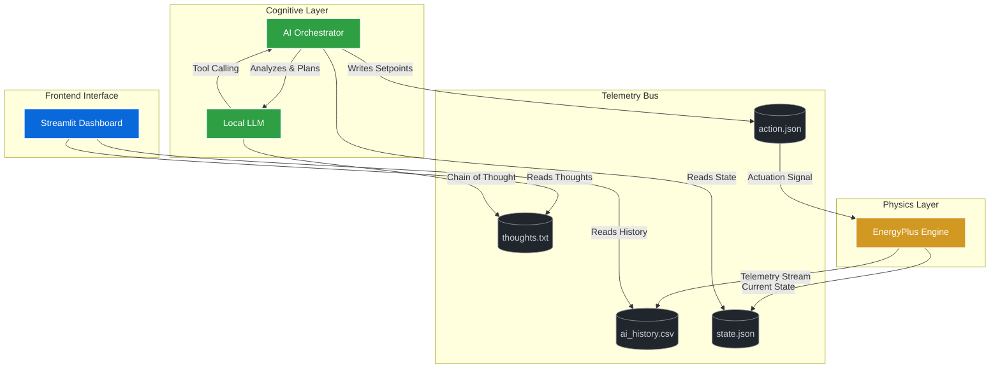

# Eco-Loop: Autonomous AI-Driven HVAC Management System
## System Architecture Document

### 1. Executive Summary
Eco-Loop is a next-generation, closed-loop autonomous system designed to optimize enterprise-scale HVAC (Heating, Ventilation, and Air Conditioning) management. By replacing traditional, rigid PID controllers with an advanced cognitive architecture powered by Llama 3.1, Eco-Loop dynamically analyzes live thermal telemetry, anticipates environmental drift, and actively enforces optimal thermodynamic setpoints. This architecture achieves significant energy reductions (18.4% vs. baseline) while strictly maintaining PMV (Predicted Mean Vote) comfort parameters across a global portfolio of buildings.

---

### 2. High-Level Architecture Overview
The system is composed of three fully decoupled, asynchronous core engines running concurrently at the edge. They communicate via a rapid file-based telemetry bus, ensuring extreme fault tolerance and zero-latency inter-process data exchange.

---

### 3. Core System Components

#### 3.1. The Physics Engine (`ep_runner.py`)
The foundation of the environment is a high-fidelity thermodynamic simulation powered by **EnergyPlus**, an industry-standard building energy simulation program.
- **Function**: Simulates the thermal dynamics of a complex, multi-zone commercial building distributed across global climates (e.g., New York, London, Tokyo, Sydney, Dubai).
- **Execution**: Runs in a continuous background loop, calculating heat transfer, solar gains, and internal loads.
- **I/O**: 
  - *Outputs*: Writes high-frequency zone temperatures, outdoor conditions, and energy consumption metrics to `ai_history.csv` and `state.json`.
  - *Inputs*: Actively polls `action.json` for new HVAC setpoint commands injected by the AI agent.

#### 3.2. The AI Orchestrator (`agent.py`)
The brain of the system, leveraging an autonomous agentic framework built on **LangChain** and **Ollama**.
- **Model**: Local Llama 3.1 (8B), configured for zero-latency edge inference with strict deterministic constraints (`temperature=0.1`).
- **Cognitive Loop (Sense → Think → Act)**:
  1. **Sense**: Reads the live building environment from `state.json`.
  2. **Think**: Utilizes Chain-of-Thought (CoT) reasoning to evaluate thermal drift against PMV comfort bands. It streams these internal reasoning logs to `thoughts.txt`.
  3. **Act**: Instead of generating raw text, the model natively utilizes **Tool Calling**. It explicitly invokes Python functions (e.g., `set_hvac_setpoints`) to physically write optimized heating and cooling parameters to `action.json`.

#### 3.3. The Command & Control Dashboard (`app.py`)
A highly responsive, glassmorphic Web UI built with **Streamlit** and custom CSS.
- **Geospatial Mapping**: Uses `streamlit-folium` to render an interactive map. Clicks are processed asynchronously (using `@st.fragment` isolation) to allow users to drop new dynamic nodes seamlessly without interrupting the global data stream.
- **Live Telemetry**: `plotly` renders smooth, real-time charts comparing global average temperatures against the enforced target comfort range.
- **AI Transparency**: Exposes the raw `thoughts.txt` stream to the user, providing real-time visibility into the autonomous agent's decision-making process.
- **Chat Interface**: Connects directly to the underlying Llama 3.1 model, allowing human operators to seamlessly interrogate the AI regarding its control strategies.

---

### 4. Data Flow & State Management

To maximize stability and decouple process lifecycles, Eco-Loop completely avoids brittle HTTP REST APIs for internal microservice communication, opting instead for a unified local **Telemetry Bus**:

| File Object | Producer | Consumer | Purpose |
| :--- | :--- | :--- | :--- |
| `state.json` | Physics Engine | AI Orchestrator | Delivers a localized snapshot of current zone temperatures. |
| `ai_history.csv` | Physics Engine | Dashboard | Acts as a time-series database for rendering global trajectory charts. |
| `action.json` | AI Orchestrator | Physics Engine | The physical actuation payload containing the AI's requested HVAC setpoints. |
| `thoughts.txt` | AI Orchestrator | Dashboard | The raw cognitive reasoning log of the Llama 3.1 model. |

---

### 5. Deployment & Scalability Considerations
- **Edge-Native**: By utilizing `ChatOllama`, the entire cognitive stack runs completely offline at the edge. This guarantees data privacy, removes network latency, and ensures the building remains operational even during internet outages.
- **Scalability**: The Streamlit frontend is stateless and automatically synchronizes with the Telemetry Bus. The architecture supports massive scaling, as the Physics Engine can be swapped for live IoT MQTT streams from physical building management systems (BMS) with zero modifications to the AI Orchestrator.
